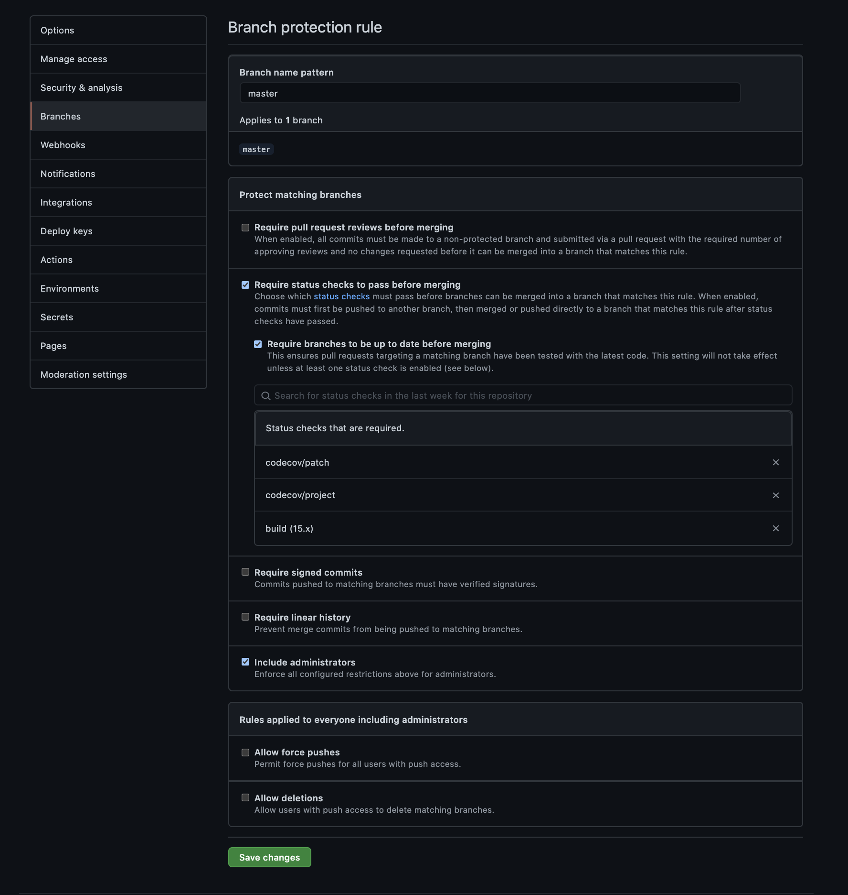

# Quality Assurance Notes

**Table des matières**

[1. Static Testing](##-1.-static-testing)

[2. Unit, Intégration, E2E testing](##-2.-unit,-Integration,-E2E-testing)

[3. Contineous Integration](##-3.-contineous-integration)

[4. Code Review](##-4.-code-review)

---

## 1. Static Testing

Our goal is to have a standard configuration for static testing (lint, formating, and automated testing) that validates our project when we are coding (displays, warn us of errors and suggests fixes) and runs as a validation step before each commit.

The same validation configuration will be run in our [Continuous Integration pipeline](##-3.-contineous-integration).

Example output after running a commit:

```console
> ci-test@1.0.0 validate
> npm-run-all --parallel check-format lint test build

> ci-test@1.0.0 check-format
> npm run prettier -- --list-different

> ci-test@1.0.0 lint
> eslint --ignore-path .gitignore --ext .js,.jsx,.ts,.tsx .

> ci-test@1.0.0 build
> babel src --out-dir dist

> ci-test@1.0.0 test
> jest --coverage

> ci-test@1.0.0 prettier
> prettier --ignore-path .gitignore --write "\*_/_.+(js|jsx|ts|tsx|json|css|html)" "--list-different"

Successfully compiled 2 files with Babel (932ms).
PASS dist/math.test.js
PASS src/math.test.js
----------|---------|----------|---------|---------|-------------------
File | % Stmts | % Branch | % Funcs | % Lines | Uncovered Line #s
----------|---------|----------|---------|---------|-------------------
All files | 100 | 100 | 100 | 100 |
dist | 100 | 100 | 100 | 100 |
math.js | 100 | 100 | 100 | 100 |
src | 100 | 100 | 100 | 100 |
math.js | 100 | 100 | 100 | 100 |
----------|---------|----------|---------|---------|-------------------

Test Suites: 2 passed, 2 total
Tests: 10 passed, 10 total
Snapshots: 0 total
Time: 1.762 s
Ran all test suites.
[static_testing_notes 3005b28] Updates notes
2 files changed, 118 insertions(+), 22 deletions(-)
rename QA Notes.md => quality-assurance-notes.md (72%)
```

### Dev Dependencies

Install the necessary dependencies with:

```console
npm install --save-dev eslint eslint-config-prettier husky npm-run-all prettier eslint-plugin-jest @babel/preset-env
```

### Scripts

Add the following scripts to your project [`package.json`](package.json):

```json
{
    ...,
    "build": "babel src --out-dir dist",
    "test": "jest --coverage",
    "prettier": "prettier --ignore-path .gitignore --write \"**/*.+(js|jsx|ts|tsx|json)\"",
    "format": "npm run prettier -- --write",
    "check-format": "npm run prettier -- --list-different",
    "lint": "eslint --ignore-path .gitignore --ext .js,.jsx,.ts,.tsx .",
    "validate": "npm-run-all --parallel check-format lint build",
    "husky-install": "husky install"
}
```

### Babel

See [`.babelrc`](.babelrc)

We configure [Babel](https://babeljs.io/docs/en/) to specify the version of Javascript we would like to work with.

### ESlint

See [`.eslintrc`](.eslintrc)

We install [ESLint](https://eslint.org/) with NPM or Yarn as a dev dependency (see [Dev Dependencies](###dev-dependencies)).

The default configuration for ESLint is that they are going to parse your files as if they are Ecmascript 5. However, our files are written in the latest version of JS. Therefore, we need configure ESLint to parse our files properly.

**VS Code Plugin**:

1. Install [ESlint plugin](https://marketplace.visualstudio.com/items?itemName=dbaeumer.vscode-eslint) on VSCode to get highlights and fixes options according to your config.
2. You can also get auto fixes by running the following command:

```console
npx eslint . --fix
```

**Summary**
In summary, we configure ESlint:

1. the type of Javascript it's going to parse
2. the ESLint built-in recommended rules configuration (`"extends":`) and specify/override some of them in `"rules":`
3. the environment where the javascript is going to run
4. on VSCode

#### **Prettier**

We use [`Prettier`](https://prettier.io/) to format our code.

We install it as a dev dependency (see [Dev Dependencies](###dev-dependencies)).

We add to our [`.eslintrc`](.eslintrc) the recommended config(`eslint-config-prettier`) when using ESLint alonside Pretter. This is to avoid conflicts.

See the `prettier`, `format` & `check-format` scripts.

If we want to add a specific configuration for pretter, we could add a `.prettierrc` file to our code base.

We also configure our tool's plugin. For VSCode, the important steps & configurations are:

1. Install the [Prettier plugin](https://marketplace.visualstudio.com/items?itemName=esbenp.prettier-vscode) from the VSCode menu
2. Set it as the default code formatter:

```json
"editor.defaultFormatter": "esbenp.prettier-vscode",
```

2. Configure format on save:

```json
"editor.formatOnSave": true,
```

### Husky

See [`.husky`](.husky/)

It's nice that we can run our validate script to check if everything is going well in our project and that we're not making any static mistakes.

It would be nicer to run this script everytime before somebody commits any code to Git. For that matter, We:

1. Install a package called [`husky`](https://github.com/typicode/husky).
2. Add a `husky-install` script to your [`package.json`](package.json):

```json
"script": {
  ...,
  "husky-install": "husky install"
}
```

3. Run the `husky-install` script:

```console
npm run husky-install
```

4. Add a pre-commit hook to run the validate script with the following command:

```console
npx husky add .husky/pre-commit "npm run validate"
```

### Résumé

En résumé, pour configurer les tests statics, nous avons:

- Installé les dépendences dev nécessaires
- Avons ajouté les scripts nécessaire
- Effectué les configuration nécessaires (ESLint, Prettier, Babel, et Husky)

Nous complèterons cette configuration à l'[étape suivante](##-2.-unit,-integration,-E2E-testing) avec des tests automatisés.

## 2. Unit, Integration, E2E testing

### Install & run Jest

- Install [Jest](https://jestjs.io/) through NPM or Yarn as a dev dependency

```console
npm install --save-dev jest
```

- Add a `test` script to your [`package.json`](package.json). We will get into the habit of always running our test with code coverage by adding the flag `--coverage`

```json
"scripts": {
  ...,
  "test": "jest --coverage"
}
```

- If necessary, update the validate script to also run the test script
- Run Jest

```console
npm run test
```

If we don't have a test in our directory, we will have an ouput similar to this one:

```console
> ci-test@1.0.0 test
> jest --coverage

No tests found, exiting with code 1
Run with `--passWithNoTests` to exit with code 0
In /Users/jlmbaka/dev/ci-test
  9 files checked.
  testMatch: **/__tests__/**/*.[jt]s?(x), **/?(*.)+(spec|test).[tj]s?(x) - 0 matches
  testPathIgnorePatterns: /node_modules/ - 9 matches
  testRegex:  - 0 matches
Pattern:  - 0 matches
```

### Écrivons notre premier test unitaire

On peut voir dans l'output précédent que Jest recherche les tests dans les fichiers et dossiers correspondant à une convention de nomenclature spécifique:

- Dossier: `__tests__/`
- Fichiers: `*test.js` ou `*.spec.js`

Dans notre dossier source, nous allons créer un fichier `math.test.js`:

```javascript
test("it works!", () => {});
```

Lancer les tests avec le script `test`

```console
% npm test

> ci-test@1.0.0 test
> jest --coverage

 PASS  src/math.test.js
  ✓ it works! (1 ms)

----------|---------|----------|---------|---------|-------------------
File      | % Stmts | % Branch | % Funcs | % Lines | Uncovered Line #s
----------|---------|----------|---------|---------|-------------------
All files |       0 |        0 |       0 |       0 |
----------|---------|----------|---------|---------|-------------------
Test Suites: 1 passed, 1 total
Tests:       1 passed, 1 total
Snapshots:   0 total
Time:        2.393 s
Ran all test suites.
```

Nous venons d'écrire notre premier test!

**Résumé**
En résumé, pour écrire notre premier test unitaire, nous avons fait ceci :

- installer Jest et ajouter un script qui s'appelle `test`
- ajouter un fichier de test à notre projet et défini un premier test
- appeler le script `test` pour faire tourner Jest

### Tutoriel

#### **Context**

https://www.youtube.com/watch?v=r9HdJ8P6GQI

#### **Unit tests**

Code:

- Start: https://github.com/academind/js-testing-introduction/tree/starting-setup
- End: https://github.com/academind/js-testing-introduction/tree/unit-tests

Steps:

- We will test `util.js/generateText`. Why this function ? Because itt doesn't have any dependencies: It does not call other functions, does not reach for the web, etc.
- Introduce a bug into `generateText`
- Create `util.test.js` and write a first test to expect the correct result for generateText
- Run `npm t`: as a result of the bug, unit tests will fail
- Correct the code so that the test passes
- Triangulate: ensure that it works for other cases. e.g. in this state, the return value of `generateText` could be hardcoded and the test would pass. Therefore, write more tests! Test every branches to have a good coverage!

#### **Integration Tests**

Code:

- Start: https://github.com/academind/js-testing-introduction/tree/unit-tests
- End: https://github.com/academind/js-testing-introduction/tree/integration-test

Steps:

1. Explore `adduser` in `app.js`:

- It's not a good candidate for an integration test because it does not really return any value and it's pretty convoluted.
- Moreover, it does several things, which is not clean. We should start first by refactoring this function so that it's broken down into several functions.

2. Refactor `addUser`:

- move validation code (lines [15:20]) to a function called `checkAndGenerate(name, age)` in `utils.js`
- replace the cut code by a call to `checkAndGenerate` in `app.js`

3. Test `checkAndGenerate`:

- Use same expectation as before
- Introduce some bugs to show why integration tests are important:
  - All units could be working but if they are combined incorrectly, you could still have bugs. This is why integration tests are necessary.
  - Unit tests couldn't do the job on their own.

#### Code Coverage

- Introduce branches into `generateText` or any other function
- This will allow us to see coverage in working
- Write tests to increase the coverage

#### **Transpile Modules with Babel in Jest Tests**

- Configure Babel to transpile Tests (see Babel's configuration in [Static testing](###-babel))

#### **React**

Code & Content:

Tutoriel officel React Testing Library
https://testing-library.com/docs/react-testing-library/example-intro#system-under-test

ou

Traduire [projet](###-tutoriel) en React et Tester

Steps:

1. Install React Testing Library as a dev dependency

```console
npm install --save-dev @testing-library/react
```

2. Follow the official tutorial

https://testing-library.com/docs/react-testing-library/example-intro

3. General Process:

- Imports
- Mock
- Arrange
- Act
- Assert

3. Cas Spécifiques: Tester l'usabilité d'un formulaire

- Install [Jest-Axe](https://github.com/nickcolley/jest-axe):

```console
npm install --save-dev jest-axe
```

- Example:

```javascript
import "jest-axe/extend-expect";
import React from "react";
import { render } from "@ testing-libary/react"
import { axe } from "jest-axe";

const Form = () => (
  <form>
    <input placeholder="email">
  </form>
);

test("the form is accessible", async () => {
  const container = render(<Form />);
  const results = await axe(container);
  expect(results).toHaveNoViolations();
});
```

4. Specifique Cases: à déterminer

#### **E2E Tests**

TODO

#### **Testing Glossary**

Access it through this link (PDF):

[Essential Testing Glossary](https://drive.google.com/file/d/1ArCKrJLBHPLlXnUBWwi0Gwrp6lAcxY4H/view?usp=sharing)

## 3. Contineous Integration

### Github

- On your project's Github, go to `Settings > Branches`
- Under `Branch protection rules`, click `Add Rule` button. This will open a window of the same name.
- Complete the `Branch name pattern` e.g. `master`
- Under `Protect matching branches`, check the following options:
  - `Require status checks to pass before merging` as well as with the `Require branches to be up to date before merging` sub-option.
  - Select the required status checks under `Status checks that are required`
  - `Include administrators`
  - [Optional] Check `Require pull request reviews before merging` if you want to enforce pull-request review before merging
- Save your configuration by click on the `Save Changes` button

This will have the effect of requiring that your Github actions workflow returns successfully before merging into the protected branch e.g. `master`.

#### Exemple Configurations

<details>
  <summary>View Github example configuration</summary>
  
</details>

### Github Actions

Voir la config dans [`.github/workflows/node.js.yml`](.github/workflows/node.js.yml)

### Codecov

- No matter the CI service you're using (Github Actions, Travis, CircleCi, etc.), it will most certainly work well with [Codecov]()
- Open our CI configuration file, in this case Github Actions' [config file](.github/workflows/node.js.yml)
- Add commands to report our codecoverage through Codecov just after the command that runs our tests (`npm run validate` in this case on [line 28](.github/workflows/node.js.yml#L28)):

```
      - name: codecov
        run: bash <(curl -s https://codecov.io/bash) -F $CIRCLE_JOB
```

- Signup for an account on Codecov and follow the instructions
- Add the [Codecov App](https://github.com/apps/codecov) to your Github project
- The codecoverage will be reported every time your workflow runs
- You can also inspect the progression of your project's code coverage on [Codecov's dashboard](https://app.codecov.io/gh/jlmbaka/contineous-integration-test)

### CircleCI (alternative to Github Actions)

- Ceux qui sont interessés peuvent eux-meme comprendre comment configurer [CircleCi](https://circleci.com/) (étapes similaires à Github Action)
- Exemple d'une configuration qui fonctionne pour les projets NodeJS:

  https://github.com/jlmbaka/contineous-integration-test/blob/master/.circleci/config.yml

## 4. Code Review

Voir les [slides](https://docs.google.com/presentation/d/1AXDmVB-KbLgL7ufU5clCC012GzhB4_9fFzljYqNXX_4/edit?usp=sharing)
